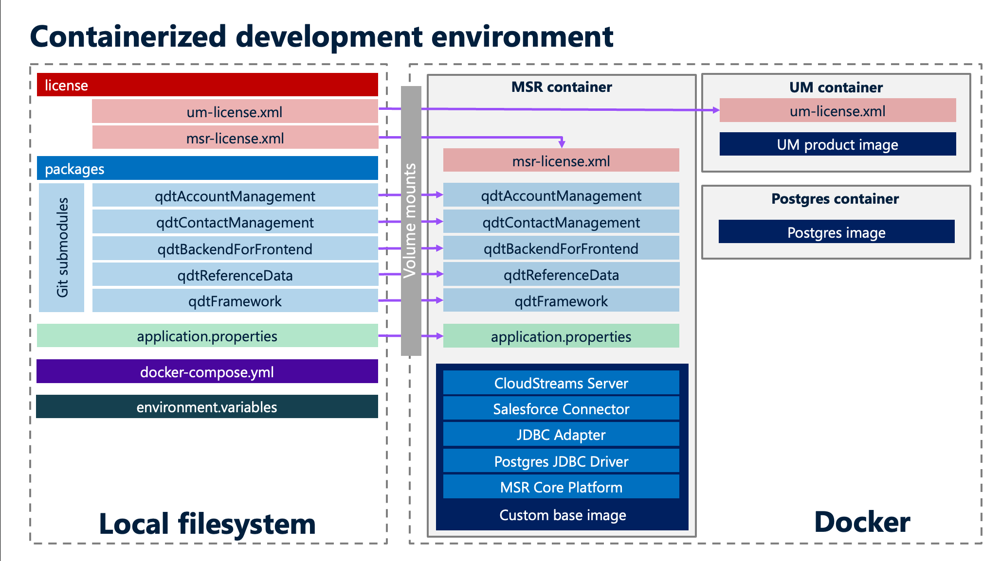

# qdtDevelopment

This repo contains various artifacts to setup the webMethods API development environment using Docker Compose.  
The following picture describes the architecture of this development environment:


We have 5 submodules for this repo, one per integration package that needs to be mounted into the Microservice Runtime.


##  Content of the Docker Compose stack

### Postgres database

We create a sandbox database, which we access using the JDBC adapter to manage contact information.
This database could also be used for the ISInternal, ISCoreAudit, ISDashboardStats and other webMethods internal schemas, but I've kept things simple here and configured an embedded database for these internal schemas.

The container is initialized with a user and a password that are defined in the environment.variables file.

### Universal Messaging

We create a simple UM realm to deal with the messaging aspects (usually publishing and consumption of EDA-style events.)
We use the product image coming from https://containers.softwareag.com here.
The UM realm needs a license file that we inject using a docker volume.

### Microservice Runtime

Finally, we also set up a MSR container, this time using a custom image that I have built. For integrations the product images in https://containers.softwareag.com are usually not sufficient, you need to add packages and other dependencies in order to have a usable platform. It's a little bit like Node.js, you usually needs to add external packages to deal with your implementation.  
The process to create the custom base image is described in the qdtBase repository: https://github.com/staillansag/qdtBase.git  

Similarly to the UM, the MSR needs a product license and we inject it the same way, using a docker volume.  

The MSR is configured using an application.properties file that is also injected into the container using a volume. Part of the properties referenced in it point to environment variables, which are injected using the environment.variables file.

Last but not least, the integration packages are also mounted using volumes, 1 volume per package. This allows local access to the packages, even though they are deployed in the containerized MSR. We can then easily use git clients to deal with version control on these packages.

##  Installation

Follow this process, step by step.

1.  Clone this repository

Simply use this command to clone the parent repo and its 5 submodules (one submodule per integration package):
```git clone --recurse-submodules https://github.com/staillansag/qdtDevelopment.git```

2.  Manage the configuration

Rename the environment.variables.example file into environment.variables, and choose passwords for Postgres and the MSR Administrator user.  

For Salesforce connectivity, this will be managed later.

Note that we don't need to change the application.properties file.  


3.  Manage the license files

Create a license folder and place in it:
-   your MSR license file, with the name msr-license.xml 
-   your UM license file, with the name um-license.xml 


4.  Start the Docker Compose stack

Ensure you're in the root qdtDevelopment folder and issue the following command:
```
docker-compose up -d
```

In some environments, it's going to be:
```
docker compose up -d
```

In some environments I have also seen issues with the health checks configured for the MSR container.
If that's your case, then remove these lines from the docker-compose.yml file:

```
    healthcheck:
      interval: 5s
      retries: 24
      test: ["CMD-SHELL", "curl -o /dev/null -s -w '%{http_code}' http://localhost:5555 | grep -qE '^(200|3[0-9]{2})$'"]
```

The output of the Docker compose command is also environment specific, here's what I see:
```
[+] Running 4/4
 ✔ Network qdt_sag   Created                                                                                                                                                                                                         0.0s
 ✔ Container postgresql  Started                                                                                                                                                                                                         0.0s
 ✔ Container umserver    Started                                                                                                                                                                                                         0.0s
 ✔ Container msr         Started
 ```

 The Postgres and UM containers should only need a few seconds to start, but the MSR container will need a bit more time, probably between 30 and 120 seconds depending on your hardward config.  

 Try connecting to the MSR admin console at http://localhost:5555 with the Administrator user and the password you defined in the environment.variables file.  
 Check the following:
 -  Messaging > JMS Settings > DEFAULT_IS_JMS_CONNECTION is enabled
 -  Adapters > webMethods Adapter for JDBC > Connections: the two connections are enabled
 -  Packages > Management: the 5 mounted qdt packages are visible and enabled

If you need to do some troubleshooting, then use the following command, which displays the server.log of the MSR:
```
docker logs msr
```

5.  Connect the designer to the MSR

Open you designer and go to Preferences (or Settings in MacOS), Software AG submenu, Integration Server, and then add a new server which points to your containerized MSR:
-   Name: Docker (or anything you like)
-   Host: localhost
-   Port: 5555
-   User: Administrator
-   Password: the password you defined for the Administrator user in environment.variables

You should then be able to connect to the containerized MSR and see its packages.  

6.  Create and initialize the Postgres tables

There are DDL files in the following locations:
-   ./packages/qdtContactManagement/resources/database/contacts.ddl.sql
-   ./packages/qdtContactManagement/resources/database/contacts-roles.ddl.sql
-   ./packages/qdtReferenceData/resources/database/reference_data.ddl.sql

There is also this batch of SQL insert commands:
-   ./packages/qdtReferenceData/resources/database/reference_data.insert.sql

These SQL files can be executed using any Database editor that's connected to Postgres.  
Alternatively you can execute them using the following commands:
```
docker cp ./packages/qdtContactManagement/resources/database/contacts.ddl.sql postgresql:/tmp/contacts.ddl.sql
docker cp ./packages/qdtContactManagement/resources/database/contacts-roles.ddl.sql postgresql:/tmp/contacts-roles.ddl.sql
docker cp ./packages/qdtReferenceData/resources/database/reference_data.ddl.sql postgresql:/tmp/reference_data.ddl.sql
docker cp ./packages/qdtReferenceData/resources/database/reference_data.insert.sql postgresql:/tmp/reference_data.insert.sql
docker exec -it postgresql psql -U postgres -d postgres -f /tmp/contacts.ddl.sql
docker exec -it postgresql psql -U postgres -d postgres -f /tmp/contacts-roles.ddl.sql
docker exec -it postgresql psql -U postgres -d postgres -f /tmp/reference_data.ddl.sql
docker exec -it postgresql psql -U postgres -d postgres -f /tmp/reference_data.insert.sql
```

7.  Import the postman assets

There are three Postman collections, 1 for each API:
- ./packages/qdtContactManagement/resources/tests/ContactManagementAutomated.postman_collection.json
- ./packages/qdtAccountManagement/resources/tests/AccountManagement.postman_collection.json
- ./packages/qdtBackendForFrontend/resources/tests/BackendForFrontend.postman_collection.json

And same for the environments:
- ./packages/qdtContactManagement/resources/tests/ContactManagement.postman_environment.json
- ./packages/qdtAccountManagement/resources/tests/AccountManagement.postman_environment.json
- ./packages/qdtBackendForFrontend/resources/tests/BackendForFrontend.postman_environment.json

Import these 6 files into Postman.

For the environments, configure the following urls to access the APIs:
-   For AccountManagement, the url is http://localhost:5555/rad/qdtAccountManagement.api:AccountManagementAPI
-   For ContactManagement, the url is http://localhost:5555/rad/qdtContactManagement.api:ContactManagementAPI
-   For BackendForFrontEnd, the url is http://localhost:5555/rad/qdtBackendForFrontend.apiServer:BackendForFrontendAPI_1_0_0

For the three environment:
-   userName = Administrator
-   password = the password you defined for the Administrator user in environment.variables

Now you're ready to test the APIs with Postman.

8.  Configuration of the CloudStreams Salesforce connector

First, create a Salesforce Oauth2 application with the following settings:
- Scopes: offline_access api refresh_token
- Ensure PKCE is not enabled (it's not useful anyway since we won't be consuming the Salesforce API from the internet)
- Callback URL: configure these 2 urls
  - https://oauth.pstmn.io/v1/callback
  - https://localhost:5543/WmCloudStreams/oauth-redirect.dsp

Then, fetch the consumer ID and secret for this application. We need to use them to get an access token and a refresh token. But you have to wait for a few minutes after the creation of the Salesforce Oauth2 application, because some configuration aspects are managed by Salesforce asynchronously.  

Next, go to Postman and create a new Collection. Edit its settings and go to the Authorization tab. Select type "Oauth 2.0" and fill in the following values under "Configure new token":
- Token name: token (or any name that you like)
- Grant type: authorization code
- Callback URL: https://oauth.pstmn.io/v1/callback (leave "Authorize using browser" unticked)
- Auth URL: https://login.salesforce.com/services/oauth2/authorize
- Access token URL: https://login.salesforce.com/services/oauth2/token
- Client ID: the consumer ID of your Salesforce Oauth2 application
- Client secret: the consumer secret of your Salesforce Oauth2 application
- Scope: offline_access api refresh_token
- State: specify a random string
- Client authentication: Send client credentials in body

Click on "Get new access token". You should see a consent screen appear in a popup window. Do provide consent, this will trigger the display of the access token and refresh token.